<h1 align="center">Hey  I'm Sammar gaikwad</h1>
<h3 align="center">Co-Founder @ Adapts.co | AI Innovator | Building Smart Tech Solutions</h3>

  

## 📌 About Me
- 🎓 I'm a B.Tech CSBS student at Bharati Vidyapeeth, Mumbai
- 🚀 Co-Founder @ Adapts.co, working on innovative tech solutions
- 💡 Passionate about Artificial Intelligence, Generative AI & real-world problem solving
- 🧠 Currently exploring Machine Learning, System Design, and scalable architectures
- 🤝 Open to collaborating on AI, IoT, and impactful tech projects
- 🔧 Skilled in building projects using ESP32, sensors, and automation systems
- 📄 Actively working on research papers and IEEE publications
- 🌱 Continuously learning, building, and growing as a developer & entrepreneur

## 🧠 My Focus Areas
- Artificial Intelligence & Machine Learning
- Generative AI & LLM Applications
- Entrepreneurship & Startup Development
- IoT & Embedded Systems (ESP32)
- Full Stack Web Development
- Cybersecurity Basics
- Research & Technical Writing (IEEE)
- Open Source Contribution

## 📊 GitHub Stats & Trophies

  
  

  

  

  

## 🛠️ Languages & Tools

> ## Programming Languages

      

> ## Frontend

    

> ## Backend

 

> ## Database

  

> ## DevOps & Cloud

    

> ## Tools

  

  

## 🔗 Connect with Me

   

<picture>
  <source media="(prefers-color-scheme: dark)" srcset="https://raw.githubusercontent.com/tobiasmeyhoefer/tobiasmeyhoefer/output/github-snake-dark.svg" />
  <source media="(prefers-color-scheme: light)" srcset="https://raw.githubusercontent.com/tobiasmeyhoefer/tobiasmeyhoefer/output/github-snake.svg" />
  
</picture>

  

